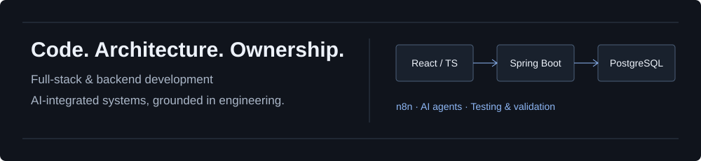

<h1 align="center">Hi, I'm Buğra Berat Kök 👋</h1>

  <strong>Software Engineering · Full-Stack &amp; Backend · Architecture · AI-Integrated Systems</strong>

  
  
  

  

<h2 align="center">🚀 About Me</h2>

  I enjoy building systems from scratch and understanding how their parts work together. 
  My foundation spans algorithms, OOP, debugging, databases, design patterns, and testing. 
  Today, I build full-stack applications, backend services, and AI-integrated systems.

  I use AI for architecture exploration, planning, implementation, debugging, review, 
  refactoring, testing, and validation — while owning the architecture, code, and system behavior.

<h2 align="center">🛠 Tech Stack</h2>

<h3 align="center">💻 Languages &amp; Full-Stack Development</h3>

  
  
  
  
  

  
  
  
  
  

<h3 align="center">⚙️ AI, Architecture &amp; Quality</h3>

  
  
  
  
  

  
  
  
  
  
  

  Modular monoliths · Layered architecture · API &amp; database design 
  Authentication / authorization · Design patterns · Repeatable validation

<h3 align="center">🎮 Game Development Foundations</h3>

  
  
  
  
  

A background in game development that informs my low-level programming, debugging, and reusable system design.

<h2 align="center">🧩 Selected Projects</h2>

| Project | Engineering focus |
| :--- | :--- |
| **[Smart Chores Tracker](https://github.com/bugraberatkok/SmartChoresTracker)** Software Engineering Capstone | Java 21 / Spring Boot, React 19 / TypeScript, PostgreSQL. Feature-oriented modular monolith, JWT and role-based access, Flyway, CI/deployment with GitHub Actions, Railway, and Vercel. |
| **[Şifa — AI Health Assistant](https://github.com/bugraberatkok/ailways-saglik-asistani)** Ailways internship demo | n8n main agent and specialized sub-agents, Gemini, Supabase/PostgreSQL. Conversational context, idempotency, output validation, unit/database/end-to-end testing. |
| **[WordPress Multisite Platform](https://github.com/bugraberatkok/demo-wordpress-multisite)** Ailways internship project | Independent site designs on shared infrastructure. Central Content Studio, live editing, media/product management, SEO/structured data, MCP and AI-assisted management experiments. |
| **[Football Analyzer AI](https://github.com/bugraberatkok/football-analyzer-ai)** | Spring Boot / React, Sofascore statistics, and Gemini analysis. MVC, Facade, Strategy, and dependency injection. |
| **[Focus — Custom C++ Game Engine](https://github.com/bugraberatkok/Focus-GameEngine-and-Two-Playable-Games)** | C++, SDL, OpenGL. Reusable rendering, game loops, input, collision, and scene systems powering two playable games. |
| **[FitTrack](https://github.com/bugraberatkok/fitness-web-app)** | Fitness and nutrition tracking with Spring Boot, Spring Security/JWT, React, and H2. |

<h2 align="center">💼 Experience</h2>

- **Ailways — Software Developer Intern** · 14 September 2026–Present AI integrations, n8n agents/sub-agents, software architecture, Şifa, and WordPress Multisite management.
- **Egemsoft — Software Testing / Test Automation Internship** · Summer 2026 Java, Selenium, JUnit/Maven, Postman, SQL, and JMeter for UI/API, regression, and performance/load testing.
- **IdeaSoft — Frontend Developer Intern** · Six-month internship Responsive interfaces, maintenance, and on-page SEO with WordPress, Elementor, HTML, CSS, and JavaScript.

<h2 align="center">📚 Academic Background</h2>

  🎓 <strong>Bahçeşehir University — B.Sc. Software Engineering</strong> 
  Expected graduation: January 2027  
  🎓 <strong>Bahçeşehir University — CEIT Double Major</strong> 
  Completed: June 2026  
  🌍 <strong>Universidad San Jorge — Erasmus Exchange</strong> 
  Zaragoza, Spain · 2025/2026 · Cryptography &amp; Computer Graphics

<strong>Turkish</strong> — Native · <strong>English</strong> — Advanced · <strong>Spanish</strong> — A1 Certificate

---

Understand the system. Design the architecture. Review the code. Validate the result.

